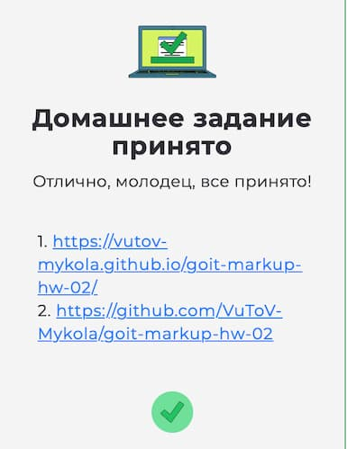
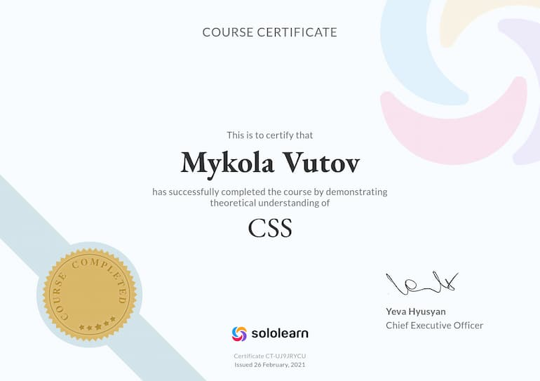

## Мої досягнення

 

## Мої сертифікати - Пройшов курс на Sololearn :

[SOLOLEARN](https://www.sololearn.com/certificates/CT-UJ9JRYCU)

## 📌 Завдання

- Створити репозиторій `goit-markup-hw-02` та скопіювати в нього файли з попередньої роботи.
- Виконати HTML-розмітку та CSS-оформлення сторінки відповідно до макета.
- Оптимізувати всі растрові зображення за допомогою [Squoosh](https://squoosh.app/).
- Налаштувати **GitHub Pages** та додати посилання на живу сторінку у секцію **About**.

---

## ✅ Критерії виконання завдання

### **Проєкт**

- `A1` Папка `images` з усіма зображеннями — в корені проєкту.
- `A2` Папка `css` з файлом стилів — в корені проєкту.
- `A3` Усі стилі зберігаються в одному файлі `styles.css`.
- `A4` Файли та папки містять лише латинські букви та слова англійською, без пробілів та великих літер.
- `A5` Код відформатовано за допомогою **Prettier**.
- `A6` Зображення та текст відповідають макету.
- `A7` Підключено `modern-normalize`.
- `A8` Растрові зображення оптимізовано у **Squoosh**.
- `A9` Виконано згідно з гайдами GoIT.

### **Розмітка**

- `B1` Секція **Our Portfolio** містить усі елементи згідно з макетом.
- `B2` Використано семантичні HTML-теги.
- `B3` Валідація HTML без помилок.
- `B4` Зрозумілі, описові назви класів.
- `B5` Назви класів — тільки англійські слова, через дефіс.
- `B6` У `` прописано атрибути `width`.
- `B7` Зображення у форматі `.jpg`.
- `B8` Однотипні елементи згруповані у списки `<ul>`.
- `B9` Підключено шрифти Raleway (700) та Roboto (400, 500, 700) одним посиланням з Google Fonts.

### **Оформлення**

- `C1` Стиль через селектори класів.
- `C2` Відсутній `!important`.
- `C3` Інтерактивні елементи мають стан `hover/focus` згідно з макетом.
- `C4` Текст контактів у хедері змінює колір при наведенні/фокусі.
- `C5` Для `<body>` задано `font-family: Roboto, sans-serif;`.
- `C6` Альтернативні шрифти вказані.
- `C7` Roboto — лише для `<body>`, інші наслідують.
- `C8` Колір тексту задано на `<body>`.
- `C9` Розміри шрифтів відповідають макету.
- `C10` `line-height` заданий множником.
- `C11` Кольори з макета.
- `C12` `font-weight` згідно дизайну.
- `C13` Кнопкам задано `cursor: pointer`.
- `C14` Не дублюються стандартні значення браузера.

---

## 🔗 Жива сторінка

[Відкрити на GitHub Pages](https://vutov-mykola.github.io/goit-markup-hw-02/)

---

## 🛠 Використані технології

- HTML5
- CSS3
- Google Fonts
- Modern Normalize
- Squoosh
- GitHub Pages
